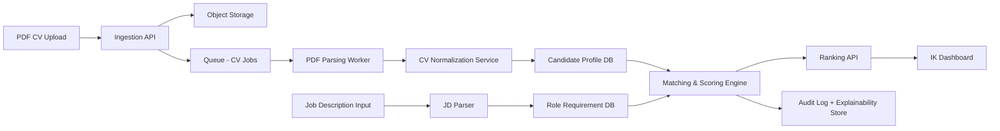

# RecruitAI Architecture

## 1) Product Goal and Scope
RecruitAI, PDF tabanli CV'leri otomatik analiz ederek IK ekiplerinin manuel on eleme eforunu en az %50 azaltmayi hedefler.

### Primary outcomes
- CV parse + normalize sureci tam otomatik.
- Role bazli uygunluk skoru ve aciklanabilir gerekceler.
- IK paneli uzerinden hizli shortlist / reject / review aksiyonlari.

### Out of scope (MVP)
- Video mulakat analizi
- Global multi-language NLP optimizasyonu (TR + EN disinda)
- Tam ATS replacement

## 2) Architecture Principles
- Human-in-the-loop: Son karar her zaman IK tarafinda kalir.
- Explainable AI: Her skor icin acik gerekce ve izlenebilir ozellik katkisi.
- Modular services: Parsleme, NLP, skorlama, bildirim ve raporlama ayrik servisler.
- Async first: Yuksek hacimli CV akisinda kuyruk tabanli isleme.
- Privacy by design: KVKK/GDPR uyumlu veri minimizasyonu ve log hijyeni.

## 3) High-Level System Design

## 4) Core Components

### 4.1 Ingestion API
- PDF upload endpoint (single/batch)
- File validation (size, mime, malware scan hook)
- Job enqueue

### 4.2 Document Parsing Worker
- OCR fallback (image-based PDF)
- Section extraction: contact, education, experience, skills
- Parse confidence score

### 4.3 Normalization Service
- Canonical schema mapping (title, skill, date ranges)
- Skill ontology mapping (Python ~= Py)
- Duplicate candidate detection

### 4.4 Matching & Scoring Engine
- Rule-based hard filters (must-have skill, min years)
- Embedding similarity (JD vs CV semantic match)
- Weighted final score (0-100)
- Explainability output: top positive/negative factors

### 4.5 IK Dashboard
- Candidate list + ranking + filters
- Explainability card
- Bulk actions (shortlist/reject/request review)

### 4.6 Audit & Analytics
- Decision audit trail
- Throughput and time-to-shortlist metrics
- False positive / false negative review queue

## 5) Data Model (MVP)
- candidates(id, name, email_hash, phone_hash, created_at)
- resumes(id, candidate_id, file_url, raw_text, parse_confidence)
- job_posts(id, title, requirements_json, created_at)
- match_scores(id, resume_id, job_post_id, score, factors_json)
- decisions(id, match_score_id, recruiter_action, note, created_at)
- audit_events(id, actor, action, entity_type, entity_id, metadata_json)

## 6) Suggested Tech Stack
- Backend API: FastAPI (Python)
- Worker: Celery/RQ + Redis queue
- DB: PostgreSQL (+ pgvector for embeddings)
- Storage: S3-compatible object store
- Frontend: React + TypeScript
- Auth: JWT/OAuth2
- Monitoring: OpenTelemetry + Prometheus + Grafana

## 7) Security, Compliance, and Governance
- PII encryption at rest + TLS in transit
- Role-based access control (Admin, Recruiter, Reviewer)
- Configurable retention and right-to-delete workflow
- Prompt and model response logging with redaction
- Bias checks per role segment (gendered terms, school bias proxies)

## 8) AI-Augmented Development Methodology (Project Process)
Bu proje AI ile hizlandirilmis ama insan denetimli bir SDLC ile yurur.

### 8.1 Loop
1. Plan: Requirement -> task graph -> acceptance criteria
2. Build: AI-assisted code generation + pair review
3. Verify: Unit/integration + eval dataset + regression checks
4. Guardrail: Security/privacy/bias gate
5. Release: Feature flag + phased rollout + observability

### 8.2 Mandatory artifacts
- Prompt contracts (input/output schema, constraints)
- Eval set (minimum 200 anonymized CV-JD pair)
- Model card (version, known limitations)
- Decision log (why this architecture/model selected)

### 8.3 Quality gates
- Parse accuracy >= 90% (critical fields)
- Ranking quality: Precision@10 >= 0.75
- Manual workload reduction >= 50%
- No P1 security finding open at release

## 9) Plan Agent Task Decomposition (Samet vs Cemilcan)

### Samet (AI/Backend Lead)
- CV parsing pipeline + normalization schema
- Matching/scoring engine + explainability factors
- Eval harness and offline benchmark scripts
- API contracts for score, reasoning, and audit endpoints
- Model/prompt versioning policy implementation

### Cemilcan (Platform/Frontend Lead)
- IK dashboard UX and recruiter workflow
- AuthN/AuthZ + role-based access
- CI/CD, environments, observability dashboards
- Data retention, audit visualization, compliance screens
- Performance optimization for list/filter/bulk actions

### Joint ownership
- Production readiness review
- Bias and quality gate sign-off
- Sprint demo and stakeholder feedback incorporation

## 10) Definition of Done (Architecture Level)
- End-to-end CV upload -> score -> recruiter action flow calisiyor.
- Explainability and audit logs retrievable.
- KPI dashboard %50 manual efor azalmasini gosterecek metrikleri topluyor.
- Security and compliance checklist tamamlandi.
